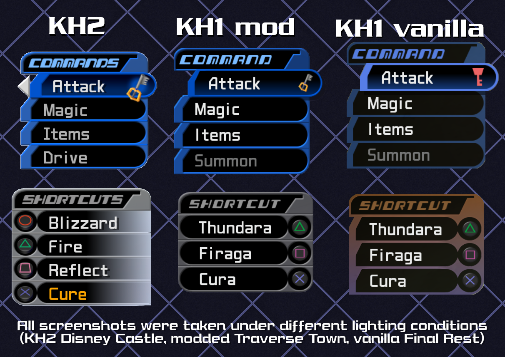

# KH1-KH2ClassicCommand
Replaces the command menu with KH2's "classic" version. I am not liable for whatever curses befall you when you use this mod.

### Known issues
- Colors for red command menu and party selector are untouched and look bad
- Reaction Command is, for some reason, stretched in-game so it looks bad for now. Will edit the texture later

#  Generative AI was not (and will never be) used in this repository.
AI-generated or AI-assisted contributions to any of my repositories are strictly prohibited, and will be turned away as quickly as possible.
